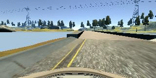
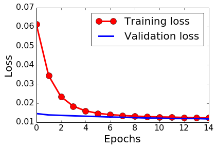

# P3: Behavioral Cloning: Predicting Steering Angles from Camera Images


This project focuses on the  behavioral cloning, i.e.,  training an AI agent to imitate human visual perceptions and driving behavior in a simulator.  Using image frames collected by the front-mounted video cameras during the simulated driving, we train a deep neural network to predict the vehicle's steering angle from the input of a captured video frame. The trained model is tested on the same track to validate if the AI agent can  "learn" the driving behavior by completing at least one loop.


### Submitted Files

The main files per the requirement include:

* model.py - the script that creates and trains the model
* drive.py - the script that loads the trained model, establishes the interface with the simulator, and drives the car
* model.json - the model architecture used in training
* model.h5 - the weights of the trained model

I also include some utility scripts for data preprocessing:

* prepare\_normal\_data.py - the script that reads, processes, combines, and saves the Udactiy data. 
* prepare\_recovery\_data.py - the script that reads, processes, combines, and saves collected recovery data. 
* combine\_normal\_recovery_data.py - the script that combines the normal and recovery driving data. The combined data will be fed into the training model.

### Test

The trained model architecture and weights are stored in `model.json` and `model.h5`, respectively. To run the trained model in the Udacity simulator, first launch the simulator, select the lowest resolution/fast speed, and switch to "AUTONOMOUS MODE". Then run:

```
python2.7 drive.py model.json
```
in Python 2.7 environment (I am still in the process of migrating to Tensorflow for Python 3.5)
or

```
python drive.py model.json
``` 
in Python 3.5 environment.

### Data Collection, Augmentation, Filtering, and Preprocessing
To successfully train the deep network, the training set needs to include both normal and recovery driving data. 

For normal driving data, I use only the samples provided by Udacity, which has a total about 24,000 images captured from left, middle, and the right cameras. 

I also include some moderate collection (about 1,500) of the recovery images, mostly captured at the spots where the undertrained models encounter some difficulties (e.g., veering off the track or not being able to make a sharp turn). For example, the following animation shows an example of recovering from almost hitting the left entrance of the bridge:



For data augmentation, I horizontally flip the normal driving (Udacity) images. This process can, to a certain degree, reduce the bias of turning left, given the fact that the test track consists of mostly left turns. I also adjust the steering angles as follows:

* Center camera image: I use the steering angle as it is.
* Left camera image: I add an offset of 0.15, i.e., \alpha+0.15, with \alpha being the steering angle. This serves as a "mild" recovery data point, to keep the vehicle back to the center of the road (by turning slightly to the right) when it deviates slightly (to the left).
* Right camera image: I add an offset of -0.15, i.e., \alpha-0.15. This again serves as a "mild" recovery data point, to keep the vehicle back to the center of the road (by turning slightly to the left) when it deviates slightly (to the right).
* Flipped center camera image: change the sign of the steer angle: \alpha-->-\alpha. That is, if the original image is associated with a left/right turn, the flipped image is associated with a right/left turn.
* Flipped left camera image: a flipped left camera image is treated as a right camera image. As such, I make the following adjustment:-(\alpha+0.15)=-\alpha-0.15
* Flipped right camera image: a flipped right camera image is treated as a left camera image. Thus, I make the following adjustment:-(\alpha-0.15)=-\alpha+0.15

For the collected recovery images, I do not implement any data augmentation. I choose to keep only a small percentage (e.g. 10%) of images with zero steering angle or extremely large turning angle (e.g. alpha=0.8), while leaving the rest intact.

For all the images, I crop out the top 50 and bottom 20 pixels and down sampling the images by a total factor of 4X4=16. The size of final input image is thus reduced to 40 X 80. The processing serve two purpose: 1) reducing irrelevant information (e.g., horizon, sky, and car hood); 2) reducing the trainable parameters and consequently the run time during training.


### Model Architecture

In this project, I use comma.ai's model (https://github.com/commaai/research/blob/master/train_steering_model.py) as a base line and train it from scratch. With five trainable layers and 559,729 trainable parameters, the model is relatively simple. It embodies the standard design practice for CNNs: the base convolutional layers' height and width progressively decrease while its depth increases, and the final layers are a series of fully-connected layers. Dropout layers were included right before the fully-connected layers, to help reduce overfitting. In particular, the model consists of the following layers:

* Data normalization layer: scale all image pixel values within the range [-1, 1], via the following operation: `x/127.5 - 1.`
* Convolution with 8x8 kernel, stride of 4, depth of 16, same padding
* ELU activation
* Convolution with 5x5 kernel, stride of 2, depth of 32, same padding
* ELU activation
* Convolution with 5x5 kernel, stride of 2, depth of 64, same padding
* Dropout with 0.2 drop probability
* ELU activation
* Fully-connected with 512 hidden units, ELU activation
* Dropout with 0.5 drop probability
* ELU activation
* Fully-connected with 1 unit (predicted steering angle)


### Training and Parameter Tuning
After much trial and error, I come up with a recipe of using a combination of 10% original Udacity data, 100% flipped Udacity data, and about 1,500 recovery images (I am still investigating why this type of mixture works). I choose a split of 92% training data and 8% validation data, since I have relatively small data set to train with (a total of about 24,000 images after augmentation and filtering). 

Following the advice by the course and peers, I use a python generator to generate batches of data. The generator approach has the advantage that only the list of filenames of the entire training and validation set need to be stored in memory -- the images themselves were read from disk only when new batch was requested.

I use an adam optimizer to minimize the mean squared error (MSE). After numerous trials, I find that a learning rate of 1e-4 produces stable results. Since the steering angle prediction  is cast as a regression problem, I use MSE as the loss function. As overfitting is a major concern, I also add L2 regularization to the model. In particular, I use a coefficient of 1e-4. 

The model was trained over 15 epochs, with a batch size of 16. I also set the checkpoints to save the model weights after each epoch. The following is the plot of the training and validation losses over training epochs:



As shown in the plot, the training loss decreases rapidly in the first few epochs and gradually plateaus. In comparison, the validation loss decreases much slowly. The two losses converge at the end of the training.

The final test in autonomous mode is shown here:
[https://youtu.be/jgoVeAlCxJo] (https://youtu.be/jgoVeAlCxJo)
The car can finish the loop and make a few recoveries during the driving. In the same YouTube channel, I also include a few videos to illustrate how I made a set of improvement at the different stages of the process.
### Future Enhancements/Experiments
As seen in the video the driving could be smoother, especially for the first sharp left turn after the bridge. Also, the AI agent is unable to complete the second track in the simulator. I plan to try the following enhancements/experiments to improve the AI agent:

* Test image processing techniques mentioned in the forum by Vivek Yadav, such as adding a random brightness filter to deal with variations of the shadow and illumination.
* Test NVIDIA's model architecture ("End to End Learning for Self-Driving Cars", http://images.nvidia.com/content/tegra/automotive/images/2016/solutions/pdf/end-to-end-dl-using-px.pdf)
* Test a transfer learning with much capable pre-trained networks such as VGG16, ResNet50, InceptionV3, etc.
* Reinforcement learning approach.

### Acknowledgement

During the process of finishing this project, I benefit a lot from the discussions, comments, and advices posted in the forum, especially those by Vivek Yadav, Patrick Kern, Paul Heraty, Youcef Rahal, and Min Lai. In the process of the coding, I am also informed and inspired by the coding practice, style, technique in the following Github repository (https://github.com/pkern90/behavioral-cloning, https://github.com/georgesung/behavioral_cloning).


